# Matching Game in Logisim

André Lucas de Souza Lima  
Kayky Moreira Morais  
Computer Science - Federal University of Cariri (UFCA)  
Developed in the Digital Circuits course  
Instructed by Professor Ramon Santos Nepomuceno  

---

## What it is about

This project is a "Matching Game" (memory game), created using the Logisim application, which is used to develop simulated low-level circuits in a digital environment.

Below is the image of the main screen:

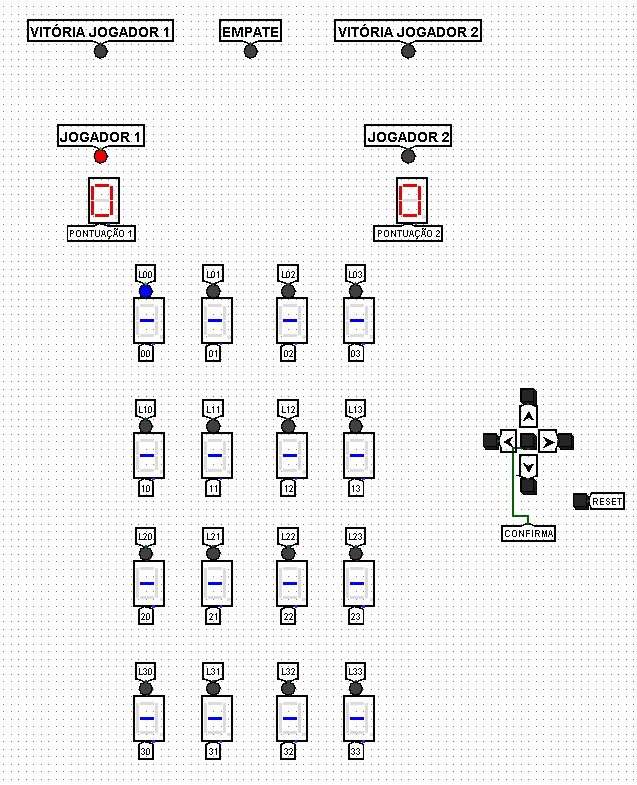

The main goal was to offer a fun experience in a functional game and to challenge ourselves with the extensive use of memory structures, such as flip-flops, registers, counters, and other tools that were essential for the final implementation.

Several revisions were also necessary throughout the work so that the result was solid and there were no inconsistencies or bugs, like the ones that will be shown and explained later.

---

## How to install Logisim

The fastest and safest way to install Logisim is through the SourceForge website, known for providing downloads on a solid platform.  
**Steps to install:** By accessing this [link](https://sourceforge.net/projects/circuit/), you should be redirected to the Logisim page on SourceForge, which will look similar to the following image:

Here, just press the main button labeled "Download", which will transfer an executable to your browser and ask for a storage location on your computer.  
After that, Logisim will be installed and ready to be executed through this file.

---

## How to play (rules)

The Matching Game (or memory game) is played by two players who must use their ability to memorize the cards to win.

Basically, the game is played in turns, where each player chooses two different cards so that their hidden numbers are revealed. If the numbers are the same, the score of the player who guessed correctly is increased by one, and the chosen cards have their numbers revealed and cannot be selected again until the end of the game. Otherwise, the score remains the same and the numbers on the cards are hidden again.

Either way, after the match verification, the turn is passed to the other player, and this repeats until all cards have been revealed and one of the players wins or there is a tie.

---

## How it works

### State Machine

The progression of the game was divided into four states so that the processes happen in an organized and correct way. These states change according to the players' actions and have specific functionalities that occur at their moments, they are:

* **State 0:** this is the idle state, where the circuit waits for the player to choose the first card.
* **State 1:** after the selection, the player presses the "CONFIRM" button over the desired display, and then, the card's number is shown and stored as the value of the first selection. Then, it waits for the second choice.
* **State 2:** just like in state 1, the "CONFIRM" button is pressed over a card different from the first one, its value is revealed and stored as the second number. Next, there is a wait to transition to the next state.
* **State 3:** repeating the press of the "CONFIRM" button once more over any display, the circuit compares both chosen numbers, and if they are equal, the player of the turn scores a point and the chosen displays remain on until the end of the game. If they are different, no point is counted for the player and the values are hidden again. At the end of this state, it automatically transitions back to the initial one, forming a loop.

To ensure the circuit identifies what to do at each moment of the game, a state machine was implemented, which is represented below:

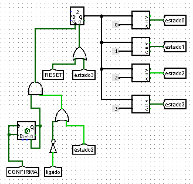

As soon as the confirm button is pressed (with delay), its pulse joins an AND gate coming from an OR gate with a negated "on" (*ligado*) tunnel and a "state 2" to increment the value of a counter responsible for representing the current state. This structure ensures that the choice of the second card only happens if the choice is not the same as the first one through the "on" tunnel (which returns 1 if the current LED is on) negated, while at the same time ensuring that the state is changed automatically in the situation where the current one is state 2, so that the player doesn't have to press the "CONFIRM" button unnecessarily.

On the right side of the image, the counter's result is obtained and compared four times so that it can pass the value 1 only to the tunnel referring to its actual state.

### LEDs

The selection LEDs are an effective way for the player to navigate the displays and make their play choice.

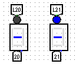

In the image above, the LED represents the circle above the hexadecimal display. It is off on the left of the image and on on the right.

Here is the control that allows navigation and defines the LEDs turned on and off:

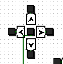

Intuitively, the buttons represent the navigation directions between the LEDs on the game grid, which can be up, down, left, and right.

The structure used to implement this LED change is:

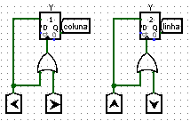

The logic is that the LED position is represented as a row and column pair stored in counters, with higher values for the row and column pointing to LEDs further to the right and down, since the LED (0, 0) is the one located in the upper left corner of the grid.

In case the right or down arrows are pressed, the column or row counters, respectively, receive a clock pulse and are increased by one unit. In contrast, pressing the left or up arrows triggers this same clock at the same time as the "load" input, which decreases the counter by one unit.

### Displays

The hexadecimal displays are the visual representation of the value stored in each of the game's "cards". They remain off (dash in the middle) until they are selected to have their values revealed.

This choice occurs by selecting the LED above the display, which will make it light up, followed by pressing the "CONFIRM" button, thus turning on the corresponding display. 
Here is the mechanism responsible for turning on the display:

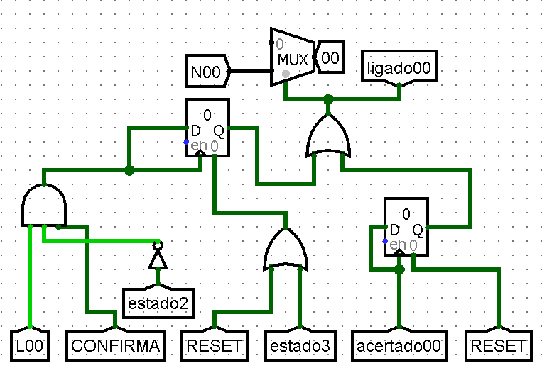

When the "CONFIRM" button is pressed, it generates a pulse that triggers the register's clock, passing through an AND gate between the "CONFIRM" pulse, the LED (to turn on the corresponding one), and a negated state 2 (this will be better explained later). This register has only one data bit and stores the information on whether the display was chosen.

Once chosen, it passes the information to a multiplexer and to an "onxy" (*ligadoxy*) tunnel, which will be useful to check if the display has already been turned on or not. The multiplexer releases the value of the corresponding number in the high input value to the "xy" tunnel (in the case of the image, "00"), which connects to the display and turns it on.

The mechanism that stores the numbers chosen by the players is shown below:

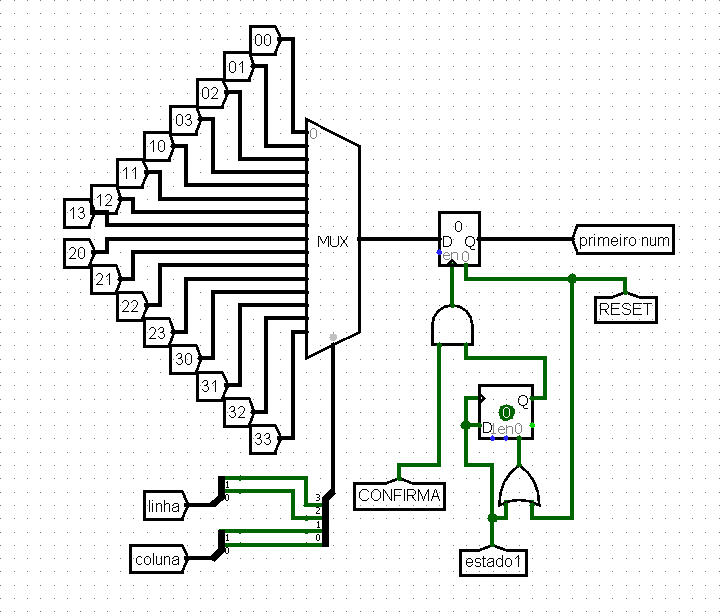

The numbers are the MUX inputs, and the selector is composed of the combination of the row and column bits. To store the first number (in state 0), as soon as the "CONFIRM" pulse occurs, there is also the state change to 1; thus, from the OR gate of the two tunnels, the register's clock is triggered and stores the first chosen number. To store the second, the mechanism is the same, except for the "state 2" and "second num" tunnels.

### Verification

The "first num" and "second num" tunnels are compared, and when the machine passes through state 3, a pulse appears in the "check" tunnel:

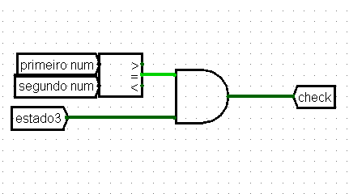

This "check" tunnel is necessary to allow the displays to remain on. The logic to keep the display on is as follows: from an AND gate between the "onxy" (*ligadoxy*) tunnels seen previously, and the "check". If the number was guessed correctly, the "correctxy" (*acertadoxy*) tunnel is triggered, and leaves the second register of the displays at 1, which only returns to 0 through the reset. This way, with the register at 1 and the OR gate, it forces the display to stay on after a correct guess.

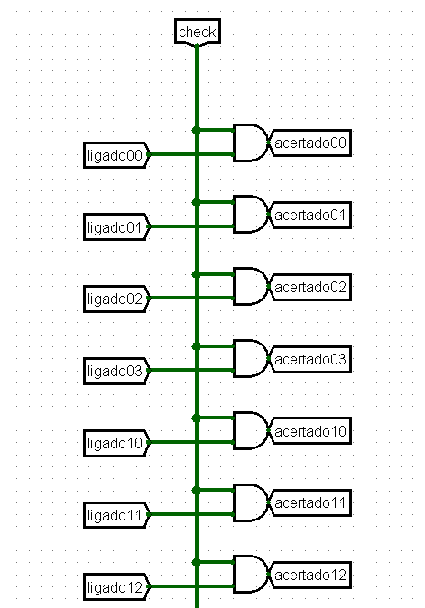

### Scoring (and next turn)

When the pairs are correct, the "check" is also directed to the scoring mechanism. The score is recorded in a counter, incremented with each correct guess and according to the player who scored. This is guaranteed by the OR between the "check" and the "player" (negated if it is player 1). The scores are passed through the "SCORE" (*PONTUAÇÃO*) tunnels so they appear on the main screen.

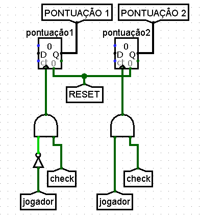

The player swap always occurs in state 3 (and following the score, if any). The players are represented by a 1-bit counter, which resets at each swap. The swap happens through an AND gate between the output of the register that stores the information that the circuit passed through state 3 and a negated "check", because the player swap cannot occur while scoring to avoid errors. The "player" tunnel is divided into "PLAYER 1" and "PLAYER 2" tunnels so that each player's turn is displayed on the screen.

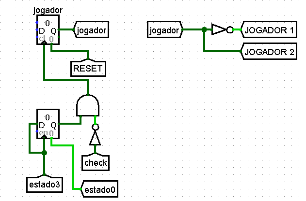

### State restriction

In order to avoid choosing an already lit display (either because it was chosen first or already guessed correctly), a state restriction mechanism was created. Initially, it prevents the state from changing if the player presses on an already lit display. It is made from an AND between the "CONFIRM" and an OR between the negated "on" (*ligado*) tunnel and "state 2".

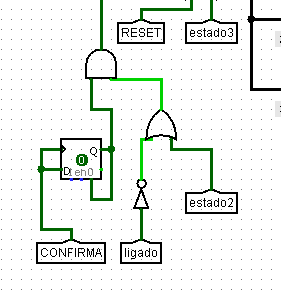

The "on" tunnel is composed of a 16-input OR gate; each input is an AND between the "onxy" and the corresponding "ledxy". In case the player decides to choose an already lit display, they will need to move the LED to the indicated display. Upon doing so, the AND triggers the "on" tunnel, which informs if the chosen display is already on. Because of this, the display chosen by the player *must not* be on, hence the use of the NOT gate.

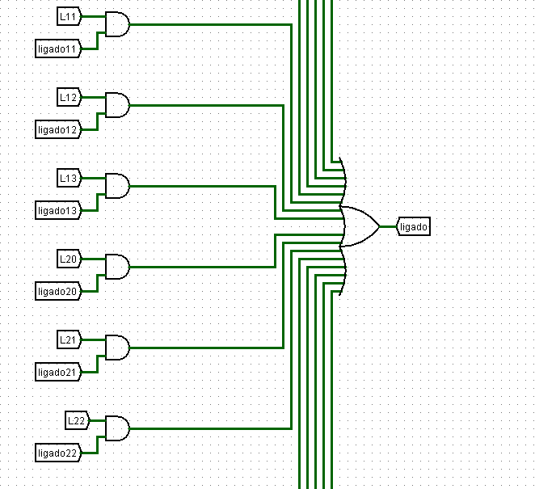

The reason behind the OR with "state 2" is quite simple: in state 2 there is no data storage, so even if an LED is on over a lit display, there is no problem pressing confirm because no value will be stored that alters the outcome of the round (whether scored or not) and the player swap. Without this OR, the player would need to change to an unlit display just to pass the turn, which is not efficient.

### Fixing occasional bugs

During the construction of the circuit, some bugs arose mainly due to clock delays. In order to solve them, some modifications were made in specific parts of the circuit.

The first of them is related to the delay of the "CONFIRM" tunnel in the state machine. It was connected to a D flip-flop; the output was connected to the confirmation AND and to the clear, allowing only a single clock pulse to be activated. Prior to this modification, the "CONFIRM" pulse generated the state change and conflicted with the "on" tunnel, which bypassed state 0 and went straight from state 3 to 1. 

Additionally, D flip-flops were also added to the "state 1" and "state 2" pulses in the registers that store the chosen numbers to guarantee their operation.

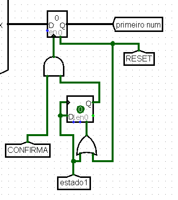

In the counter responsible for the players' turn, a register had to be added for state 3 and a negated "check", because in state 3 the scoring and the player swap occur, which caused a sufficient pulse to score both players at the same time. Therefore, the modification made stores state 3 and, once the score has already been made (that is, it is *not* checking), the turn is passed right after.

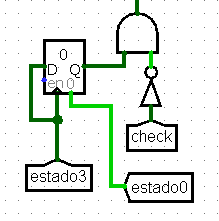

Finally, the last alteration made was inserting a 3-input AND gate for the displays' register, because without it, if a player guessed a pair correctly and moved to another unlit display before passing the turn, it would turn on and impede the progress of the game.

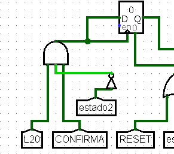

### Randomness

The circuit has a simple randomness system. It works from a 4-bit random number generator that, depending on the generated number, selects a sequence to be displayed in each row of the game.

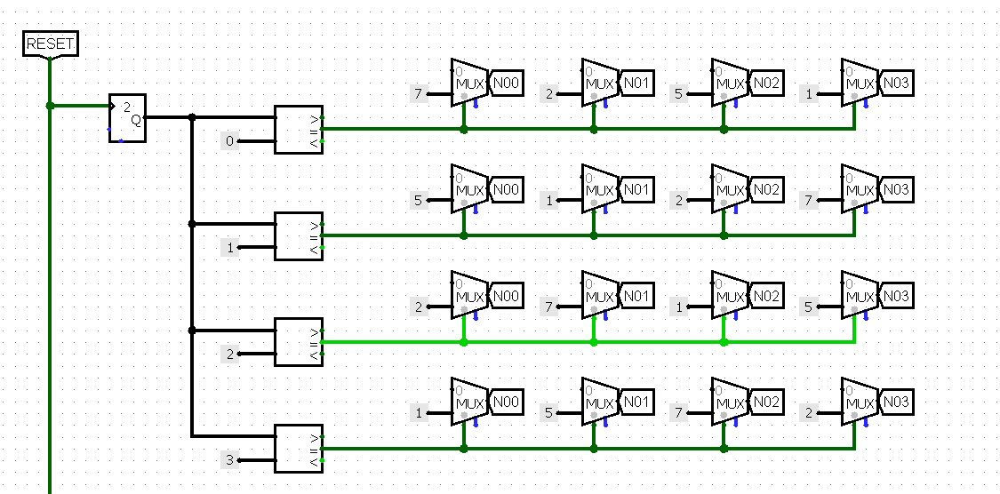

Following the image above as an example, if the generator shows 0, the number 7 is displayed on the "N00" tunnel display; if it shows 2, the number 2 is displayed. Thus, since there are 4 rows, there are 4 generators and each generator has 4 different sequences, providing a total of 256 possibilities.