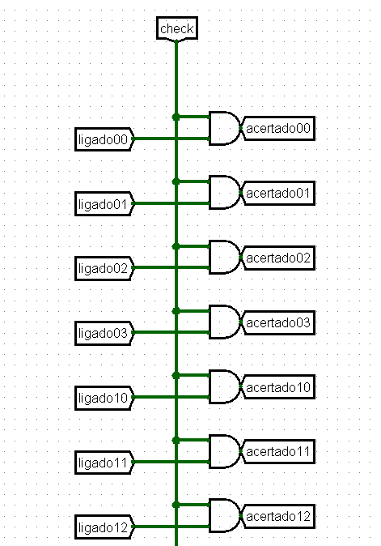
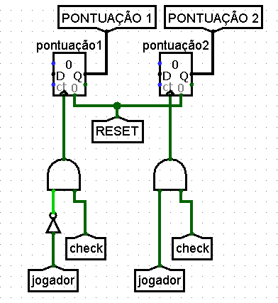
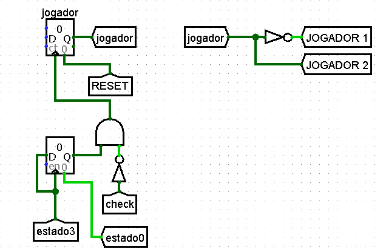
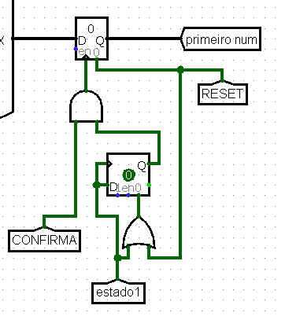

<h1>Matching Game no Logsim</h1>

<h2>Do que se trata</h2>

<h2>Como instalar o Logsim</h2>

<h2>Como jogar(regras)</h2>

<h2>Funcionamento</h2>

<h3>Máquina de estado</h3>
<h3>Leds</h3>
<h3>Displays</h3>

<h3>Escolha dos displays</h3>
O jogador após posicionar o led aperta o botão "CONFIRMA", dessa maneira o display correspondente é aceso. 
Eis o mecanismo responsável por acender o display:

Quando o botão "CONFIRMA" é pressionado, ele gera um pulso que aciona o clock do registrador, passando por uma porta AND entre o pulso "CONFIRMA", o led (para acender o correspondente) e um estado 2 negado(será explicado melhor adiante). Esse registrador tem apenas um bit de dados e guarda a informação se o display foi escolhido.
Uma vez escolhido, ele passa a informação para um multiplexador e para um túnel "ligadoxy", o qual será útil para verificar se o display já foi aceso ou não. O multiplexador libera o valor do número correspondente no valor de entrada alto para o túnel "xy" (no caso da imagem, "00"), que se conecta ao display e o acende.
O mecanismo que guarda os números escolhidos pelos jogadores é mostrado a seguir:

Os números são as entradas do MUX, e o seletor é composto pela combinação dos bits da linha e coluna. Para guardar o primeiro número (no estado 0), assim que há o pulso do "CONFIRMA" também há a troca de estado para 1,assim a partir da porta OR dos dois túneis, o clock do registrador é acionado e guarda o primeiro número escolhido. Para guardar o segundo é o mesmo mecanismo, exceto pelos túneis "estado 2" e "segundo num".

<h3>Verificação</h3>
Os túneis "primeiro num" e "segundo num" são comparados, e quando a máquina passa pelo estado 3, surge um pulso no túnel "check":

Esse túnel "check" é necessário para permitir que os displays permaneçam acesos. A lógica para permanecer o display aceso é aseguinte: A partir de um AND entre os túneis "ligadoxy", vistos anteriormente, e o "check". Se o número foi acertado, o túnel "acertadoxy" é acionado, e deixa o segundo registrador dos displays em 1, o qual só volta a 0 a partir do reset. Dessa forma, com o registrador em 1 e a porta OR, ele força o display ficar aceso após o acertado. 

<h3>Pontuação (e próximo turno)</h3>
Quando os pares estão corretos, o "check" também é direcionado para o mecanismo de pontuação. A pontuação é registrada em um contador, incremetado a cada acerto e de acordo com o jogador que pontuou. Isso é
garantido pelo OR entre o "check" e o "jogador"(negado se for o jogador 1. As pontuações são passadas pelos tunéis "PONTUAÇÃO" para que apareçam na tela principal.

A troca de jogador ocorre sempre no estado 3 (e em seguida da pontuação, se houver). Os jogadores são representados por um contador de 1 bit, que se reinicia a cada troca. A troca acontece por um AND entre a saída do registrador que armazena a informação que o circuito passou pelo estado 3 e um "check" negado, pois não pode haver a troca de jogador enquanto pontua para evitar erros. O túnel "jogador" é dividido para os túneis "JOGADOR 1" e "JOGADOR 2" a fim do turno de cada jogador ser exibido na tela.

<h3>Restrição de estado</h3>
Com o intuito de evitar a escolha de um display já aceso (seja porque foi escolhido primeiro ou já acertado), um mecanismo de restrição de estado foi criado. A princípio, ele impede que haja a troca de estado se o jogador apertar num display já aceso. Ele é feito a partir de um AND entre o "CONFIRMA" e um OR entre o túnel "ligado" barrado e "estado 2".

O túnel ligado é composto por um OR de 16 entradas, cada entrada é um AND entre o "ligadoxy" e o "ledxy" correspondente. Caso o player decida escolher um display já aceso ele precisará mover o led até o display indicado, ao fazer isso, o AND aciona o túnel "ligado", que informa se o display escolhido já está ligado. Dessa maneira, é preciso que o display escolhido pelo jogador *não* esteja aceso, por isso o uso da porta NOT.

O motivo por trás do OR com "estado 2" é bastante simples: no estado 2 não há o armazenamento de dados, dessa forma, mesmo que um led esteja aceso em cima de um display ligado, não há problema apertar o confirma pois nenhum valor será armazenado que altere o resultado da rodada (se pontuou ou não) e a troca de jogador. Sem esse OR, seria necessário que o jogador mudasse para um display desligado apenas para passar a vez, o que não é eficiente.

<h3>Correção de eventuais bugs</h3>
Durante a construção do circuito, alguns bugs surgiram principalmente por motivos de atraso de clock. A fim de resolvê-los, algumas modificações foram feitas em partes específicas do circuito.
O primeiro deles é relacionado ao atraso do túnel "CONFIRMA" na máquina de estado. Ele foi conectado a um flip flop D, a saída foi conectada ao AND de confirmação e ao clear, permitindo que apenas um único pulso de clock seja ativado. Anteriormente a essa modificação, o pulso do "CONFIRMA" gerava a mudança de estado e entrava em conflito com o túnel "ligado", o que ignorava o estado 0 e passava do estado 3 direto para o 1. 

Além disso, flip flops D também foram adicionados ao pulso do "estado 1" e "estado 2" nos registradores que guardam os números escolhidos para garantir seu funciomnamento.

No contador pesponsável pelo turno dos jogadores, foi preciso adicionar um registrador para o estado 3 e um "check" negado pois no estado 3 ocorrem a pontuação e a troca de jogador, o que ocasionava um pulso suficiente para pontuar os dois jogadores ao mesmo tempo. Portanto, a modificação feita guarda o estado 3 e, quando a já pontuação ter sido feita (ou seja, *não* está checando), logo após passa o turno.

Por fim, a última alteração realizada foi inserir uma porta AND de três entradas para o registrador dos displays, pois sem isso, caso um player acertasse um par, e mudasse para para outro display desligado antes de passar a vez, este era aceso e impedia o andamento do jogo.

<h3>Aleatoriedade</h3>
O circuito possui um sistema simples de aleatoriedade. Ele funciona a partir de um gerador de número aleatório de 4 bits que, a depender do número gerado, seleciona uma sequência para ser exibida em cada linha do jogo.

Seguindo a imagem acima como exemplo, se o gerador marcar 0, o número 7 é exibido no display do túnel "N00", já se marcar 2, o número 2 é exibido. Assim, como são 4 linhas, há 4 geradores e cada gerador possui 4 sequências diferentes, o que fornece um total de 256 possibilidades. 
